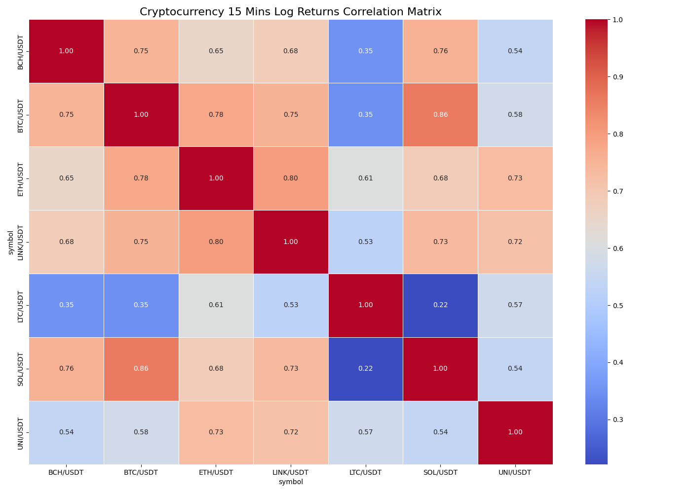
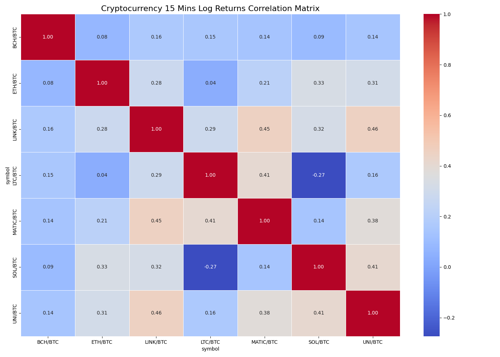

Project completed as university assignment at HTW Berlin in the module "Business Software"
Group: Massimo Diego Marsiglia, Thi Thanh Hang Truong, Farhan Jalal

# Trading Crypto

### Problem Definition
**Concide Description of the problem**

We aim to build a machine learning model that predicts the long-term trend of cryptocurrency prices based on historical market data.

**Target**

The model will predict the price movement signal (log_return) over these time horizons:

- 15 mins
- [1, 4] hours
- 1 day

**Input Features**
- Raw market data (OHLCV): Open price, high price, low price, close price
- Technical indicators: Volume, VWAP, Trade Count, EMA, MACD, RSI, ATR, Bollinger Bands, OBV, log return (past)

## Step 1: Data Acquisition
**Approach to Acquire Raw Data**

We will obtain historical cryptocurrency data via the Alpaca API:

1. Targeting the crypto market, including major coins such as BTC, ETH, LTC and SOL
2. Requesting historical OHLCV data over different intervals
3. Storing the raw data locally in CSV files for preprocessing and feature engineering

**APIs Used**
- Alpaca

**Script**
[scripts/01_data_acquisition/OHLCV_retriever.py](./scripts/01_data_acquisition/OHLCV_retriever.py)

Pulls data from **2020-01-01 -> 2025-09-12** and writes `.csv` files to folder `data/large_data`

Data example:  
[data/large_data/01_USDTpairs_OHLCV_15Mins.csv](./data/large_data/01_USDTpairs_OHLCV_15Mins.csv)

---

## Step 2: Data Understanding 

### Correlation Heatmaps (Log Returns)
Correlation matrices were created for all timeframes, separately for USDT pairs and BTC pairs.  
These show how strongly cryptocurrencies move together and help identify redundant vs. independent assets.

Example grids:
- `02_USDTpairs_15mins_Correlation_Heatmap.png`

- `02_BTCpairs_15mins_Correlation_Heatmap.png`

### Strong & Weak Pair Trend Comparison
Using the **1D USDT correlation heatmap**, we selected:
- Two **strongest positively correlated** pairs
- One **weakest correlated** pair

Their normalized line charts help visualize long-horizon co-movement.  
Output saved under: `images/03_features_plotting/`

---

## Step 3: Data Preparation (Pre-Split)

### Focus
- **Main target pairs:** BTC/USDT, ETH/USDT, LTC/USDT, SOL/USDT
- **Base timeframe:** 15m
- **Secondary BTC-pairs:** ETH/BTC, LTC/BTC, SOL/BTC

### Technical Indicators
Computed using `ta`:
- EMA, RSI, MACD, ATR, Bollinger Bands
- VWAP, Volume, Trade Count, OBV
- Log Return

All features aligned to 15m timestamps.

### Technical Indicator Correlation (Clean Matrix)
We built a compact **12×12** correlation matrix using:
- 4 USDT pairs (BTC, ETH, LTC, SOL)
- 3 indicators each (EMA9, MACD, RSI14)
- 15m timeframe

This helps check redundancy and confirms that RSI, EMA, and MACD contribute distinct signal types.

Result saved at:  
`images/03_features_plotting/USDT_4pairs_15m_technical_correlation.png`

### Target
Future log-return for:
`["BTCUSDT", "ETHUSDT", "LTCUSDT", "SOLUSDT"]`

---

## Step 4: Split Data

- Split before normalization to prevent leakage
- Split into train, val and test data
- No normalization, log returns already stationary
- Model will use layer normalization instead

**Script:**  
[scripts/04_split_data/split_dataset.py](./scripts/04_split_data/split_dataset.py)

## Step 5: Post-Split

- Split into X and y data for train/val/test
- Drop missing value

## Step 7: Model Training

### (1). Feed Forward

**Step:**
- Loads experiment config and the engineered feature list
- Builds a simple MLP regressor with:
  - ReLU activations
  - Adam optimizer
  - Learning rate: 0.005
  - Batch size: 64
  - Criterion: MSEloss
- Implenment early stopping
- Saves best checkpoints for lowest validation loss

**Script**
[scripts/07_model_training/01_feed_forward.py](./scripts/07_model_training/01_feed_forward.py)

**Models:**  
[07_01_feed_forward.pt](./models/07_01_feed_forward.pt)

### (2). LSTM

**Step:**
- Create sequence with sequence length = 16
- Batch size: 64
- min_delta = 1e-4
- implement early stopping

**Script**  
[scripts/07_model_training/02_LSTM.py](./scripts/07_model_training/02_LSTM.py)

**Models:**  
[07_02_LSTM.pt](./models/07_02_LSTM.pt)

## Step 8: Backtesting

Details for backtesting can be found in the part 8: Backtesting from `backtesting_docu.pdf`

Link to the related documentation:
[backtesting_docu.pdf](backtesting_docu.pdf)

## Step 9: Deployment
Deploy trading strategy using trained feed forwward network to generate log return prediction to determine buy and sell signal

**Scripts**
[main_v2.py](scripts/09_deployment/main_v2.py)

**Plots**

2 deployment versions have been tested over different time period:
- From 30 December 2025 to 03 January 2026: version 1
- From 17 January to now: version 2

#### *Trading performance* 

    - Over not a long time period because of some interruption (exp. request error, notional value error, ...)
    - For every 15mins model will predict the log_return_4h and make decision to buy or sell (or neither buy nor sell)

## Update ideas (Next steps)
- update to trade with multiple coins 
- trade with higher risk and more money 
